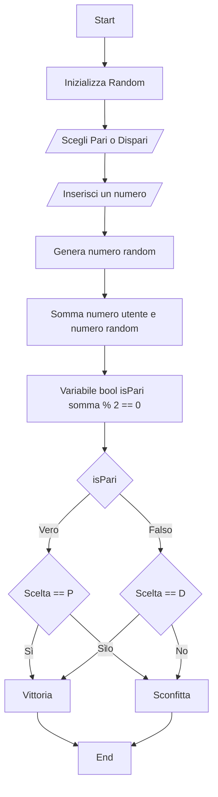

# Indovina pari e dispari

il pc sorteggia un numero a caso da 1 a 100 e chiede all'utente di indovinare se  sarà pari o dispari.
 Se ci sarà una corrispondenza tra la nostra scelta e quella che verrà sorteggiata verrà restituito un messaggio 

bool pari = somma % 2 == 0;

