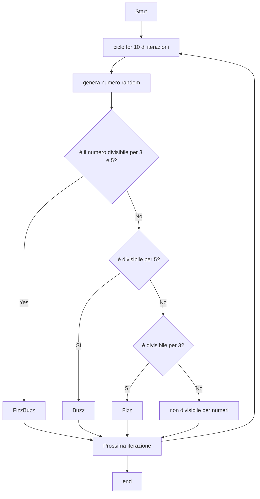

# Progetto Fizzbuzz

### Applicazione che valuta la divisibilità di un numero casuale per 3 e 5 

- Viene impostato un ciclo per fare girare l'applicazione 10 volte


- viene generato un numero random da 1 a 100

    - ```c#
        Random random = new Random();

        int numeroComputer = random.Next(1, 101);

        ```


- se il numero estratto è sia divisible per 3 che per 5 il viene stampata a schermo la parola **Fizzbuzz**

     - ```c#
        if ((numeroComputer % 3 == 0) && (numeroComputer % 5 == 0))
        {
            Console.WriteLine("FizzBuzz");
            }
        
        ```

-  se il numero è divisibile solo per 5 esce la parola **Buzz**

    - ```c#
            else if ((numeroComputer % 5 == 0))                    
            {
            Console.WriteLine("Buzz");}
            
        ```

-  se il numero è divisibile solo per 3 esce la parola **Fizz**

    -  ```c#
            else if ((numeroComputer % 3 == 0))                    
            {
            Console.WriteLine("Fizz");}
            
        ```
- Di seguito viene mostrato un diagramma per comprendere meglio la logica dell'algoritmo

