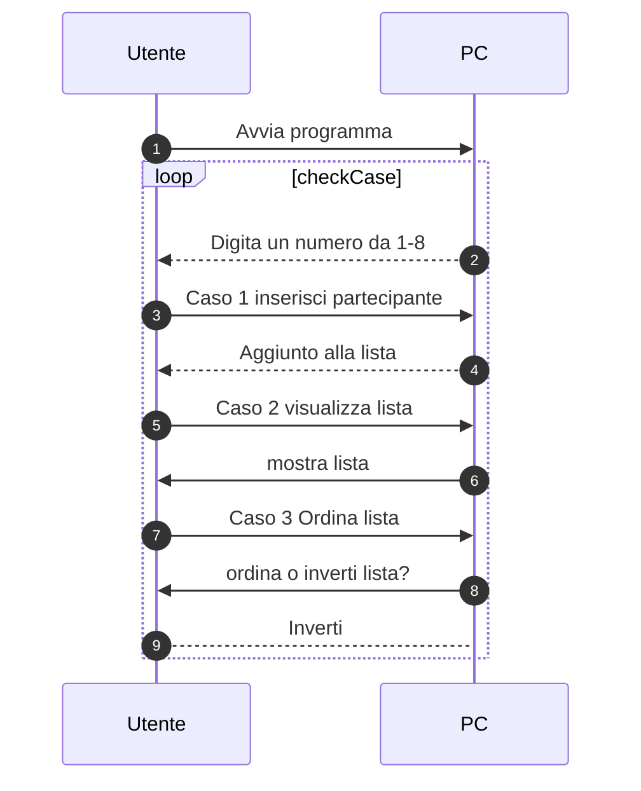
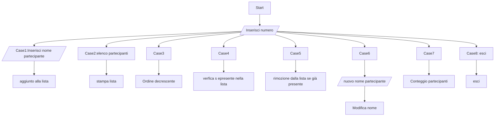

# ELENCO COMPAGNI DI CORSI CON SORTEGGIO

## VERSIONE 1
// Creare una console app che contiene un elenco di nomi dei partecipanti del corso
// La app sorteggia un nome e lo visualizza

<details>Codice

```csharp
List<string> nomi = new List<string>();
nomi.Add("Mario");
nomi.Add("Luigi");
nomi.Add("Giovanni");

Random random = new Random();

int indice = random.Next(nomi.Count);

Console.WriteLine($"Il nome sorteggiato è {nomi[indice]}");
```

// si possono inserire piu nomi in contemporanea invece di uno alla volta cosi
```csharp

// array
nomi.AddRange(new string[] { "Mario", "Luigi", "Giovanni" });

// List
List<string> nomi = new List<string> { "Mario", "Luigi", "Giovanni" };
List<string> nomi = ["Mario", "Luigi", "Giovanni"];
```

</details>

// il metodo RemoveAt(indice) ci permette di eliminare un nome una volta che è stato estratto

## VERSIONE 2
// Creare una console app che contiene un elenco di nomi dei partecipanti del corso
// La app sorteggia un nome e lo visualizza
// la app toglie dalla lista il nome sorteggiato
// la app visualizza la lista dei nomi rimanenti

<details>

```csharp
List<string> nomi = new List<string>();
nomi.Add("Mario");
nomi.Add("Luigi");
nomi.Add("Giovanni");

Random random = new Random();
int indice = random.Next(nomi.Count);

Console.WriteLine("Elenco partecipanti:");
foreach (string nome in nomi)
{
    Console.WriteLine(nome);
}

Console.WriteLine($"Il nome sorteggiato è {nomi[indice]}");

nomi.RemoveAt(indice);

Console.WriteLine("Elenco partecipanti:");
foreach (string nome in nomi)
{
    Console.WriteLine(nome);
}
```
</details>
## VERSIONE 3

// Creare una console app che contiene un elenco di nomi dei partecipanti del corso
// La app sorteggia un nome e lo visualizza
// la app toglie dalla lista il nome sorteggiato
// la app visualizza la lista dei nomi rimanenti
// la app continua a sorteggiare finchè ci sono nomi nella lista

<details>

```csharp
List<string> nomi = new List<string>();                         // dichiarazione di una lista di stringhe
nomi.Add("Mario");
nomi.Add("Luigi");
nomi.Add("Giovanni");
Random random = new Random();
while (nomi.Count > 0)
{
    int indice = random.Next(nomi.Count);                       // generazione di un numero casuale tra 0 e il numero di elementi della lista
    Console.WriteLine($"Il nome sorteggiato è {nomi[indice]}"); // visualizzazione del nome sorteggiato
    nomi.RemoveAt(indice);                                      // rimozione del nome sorteggiato dalla lista
    Console.WriteLine("Elenco partecipanti:");                  // visualizzazione dell'elenco dei partecipanti
    foreach (string nome in nomi)
    {
        Console.WriteLine(nome);
    }
}
```
</details>

## VERSIONE 4

// Creare una console app che contiene un elenco di nomi dei partecipanti del corso
// La app sorteggia un nome e lo visualizza
// la app toglie dalla lista il nome sorteggiato e lo aggiunge ad una seconda lista
// la app visualizza la lista dei nomi rimanenti
// la app visualizza la lista dei nomi sorteggiati
// la app continua a sorteggiare finchè ci sono nomi nella lista

<details>

```csharp

// genero le lise e l'oggetto random
// ----------------------------------------------------------------------------
List<string> nomi = new List<string>();
nomi.Add("Mario");
nomi.Add("Luigi");
nomi.Add("Giovanni");

List<string> sorteggiati = new List<string>();

Random random = new Random();
// ----------------------------------------------------------------------------
while (nomi.Count > 0)
{
    int indice = random.Next(nomi.Count);
    string sorteggiato = nomi[indice];  // estrazione del nome sorteggiato

    Console.WriteLine($"Il nome sorteggiato è {sorteggiato}");

    // ----------------------------------------------------------------------------
    nomi.RemoveAt(indice);
    sorteggiati.Add(sorteggiato);
    // ----------------------------------------------------------------------------

    Console.WriteLine("Elenco partecipanti:");
    foreach (string nome in nomi)
    {
        Console.WriteLine(nome);
    }

    Console.WriteLine("Elenco sorteggiati:");
    foreach (string nome in sorteggiati)
    {
        Console.WriteLine(nome);
    }
}
```
</details>

## VERSIONE 5

// Creare una console app che contiene un elenco di nomi dei partecipanti del corso
// La app permette di inserire un nuovo partecipante
// La app visualizza la lista dei partecipanti
// La app permette di uscire

<details>

```csharp
//----eseguo fuori dai loops----------------------------------------------------------
List<string> partecipanti = new List<string>();
string nome;
int scelta;
//------------------------------------------------------------------------------------
do
{
    Console.WriteLine("1. Inserisci partecipante");
    Console.WriteLine("2. Visualizza partecipanti");
    Console.WriteLine("3. Esci");
    Console.Write("Scelta: ");
    scelta = Convert.ToInt32(Console.ReadLine());
    switch (scelta)
    {
        case 1:
            Console.Write("Nome partecipante: ");
            nome = Console.ReadLine();
            partecipanti.Add(nome);
            break;
        case 2:
            Console.WriteLine("Elenco partecipanti:");
            foreach (string partecipante in partecipanti)
            {
                Console.WriteLine(partecipante);
            }
            break;
        case 3:
            Console.WriteLine("Arrivederci!");
            break;
        default:
            Console.WriteLine("Scelta non valida");
            break;
    }
}
while (scelta != 3); // il ciclo continua finchè la scelta è diversa da 3
```

</details>

## VERSIONE 6

// Creare una console app che contiene un elenco di nomi dei partecipanti del corso
// La app permette di inserire un nuovo partecipante
// La app visualizza la lista dei partecipanti
// La app permette di uscire
// la app permette di ordinare la lista dei partecipanti in ordine alfabetico

<details>

```csharp
partecipanti.Sort(); // ordinamento della lista in ordine alfabetico tramite il metodo Sort
partecipanti.Reverse(); // ordinamento della lista in ordine alfabetico inverso tramite il metodo Reverse
```
```csharp
List<string> partecipanti = new List<string>();
string nome;
int scelta;
do
{
    Console.WriteLine("1. Inserisci partecipante");
    Console.WriteLine("2. Visualizza partecipanti");
    Console.WriteLine("3. Ordina partecipanti");
    Console.WriteLine("4. Esci");
    Console.Write("Scelta: ");
    scelta = Convert.ToInt32(Console.ReadLine());
    switch (scelta)
    {
        case 1:
            Console.Write("Nome partecipante: ");
            nome = Console.ReadLine();
            partecipanti.Add(nome);
            break;
        case 2:
            Console.WriteLine("Elenco partecipanti:");
            foreach (string partecipante in partecipanti)
            {
                Console.WriteLine(partecipante);
            }
            break;
        case 3:
            Console.WriteLine("1. Ordine crescente");
            Console.WriteLine("2. Ordine decrescente");
            Console.Write("Scelta: ");
            int ordine = Convert.ToInt32(Console.ReadLine());
            if (ordine == 1)
            {
                partecipanti.Sort(); // ordinamento della lista in ordine alfabetico tramite il metodo Sort
            }
            else if (ordine == 2)
            {
                partecipanti.Sort();
                partecipanti.Reverse(); // ordinamento della lista in ordine alfabetico inverso tramite il metodo Reverse
            }
            else
            {
                Console.WriteLine("Scelta non valida");
            }
            break;
        case 4:
            Console.WriteLine("Arrivederci!");
            break;
        default:
            Console.WriteLine("Scelta non valida");
            break;
    }
} while (scelta != 4);
```

</details>

## VERSIONE 7

// cerca un partecipante specifico

<details>

```csharp
partecipanti.Contains(nome)

```

/ Creare una console app che contiene un elenco di nomi dei partecipanti del corso
// La app permette di inserire un nuovo partecipante
// La app visualizza la lista dei partecipanti
// La app permette di uscire
// la app permette di ordinare la lista dei partecipanti in ordine alfabetico
// la app permette di cercare un partecipante nella lista
```csharp
List<string> partecipanti = new List<string>();
string nome;
int scelta;

do
{
    Console.WriteLine("1. Inserisci partecipante");
    Console.WriteLine("2. Visualizza partecipanti");
    Console.WriteLine("3. Ordina partecipanti");
    Console.WriteLine("4. Cerca partecipante");
    Console.WriteLine("5. Esci");
    Console.Write("Scelta: ");
    scelta = Convert.ToInt32(Console.ReadLine());
    switch (scelta)
    {
        case 1:
            Console.Write("Nome partecipante: ");
            nome = Console.ReadLine();
            partecipanti.Add(nome);
            break;
        case 2:
            Console.WriteLine("Elenco partecipanti:");
            foreach (string partecipante in partecipanti)
            {
                Console.WriteLine(partecipante);
            }
            break;
        case 3:
            Console.WriteLine("1. Ordine crescente");
            Console.WriteLine("2. Ordine decrescente");
            Console.Write("Scelta: ");
            int ordine = Convert.ToInt32(Console.ReadLine());
            if (ordine == 1)
            {
                partecipanti.Sort();
            }
            else if (ordine == 2)
            {
                partecipanti.Sort();
                partecipanti.Reverse();
            }
            else
            {
                Console.WriteLine("Scelta non valida");
            }
            break;
        case 4:
            Console.Write("Nome partecipante: ");
            nome = Console.ReadLine();
            if (partecipanti.Contains(nome))
            {
                Console.WriteLine("Il partecipante è presente nella lista");
            }
            else
            {
                Console.WriteLine("Il partecipante non è presente nella lista");
            }
            break;
        case 5:
            Console.WriteLine("Arrivederci!");
            break;
        default:
            Console.WriteLine("Scelta non valida");
            break;
    }
} while (scelta != 5);
```

</details>

## VERSIONE 8

<details>

```csharp
List<string> partecipanti = new List<string>();
string nome;
int scelta;

do
{
    Console.WriteLine("1. Inserisci partecipante");
    Console.WriteLine("2. Visualizza partecipanti");
    Console.WriteLine("3. Ordina partecipanti");
    Console.WriteLine("4. Cerca partecante");
    Console.WriteLine("5. Esci");
    Console.Write("Scelta: ");
    scelta = Convert.ToInt32(Console.ReadLine());
    switch (scelta)
    {
        case 1:
            Console.Write("Nome partecipante: ");
            nome = Console.ReadLine();
            if (partecipanti.Contains(nome))
            {
                Console.WriteLine("Il partecipante è già presente nella lista");
            }
            else
            {
                partecipanti.Add(nome);
            }
            break;
        case 2:
            Console.WriteLine("Elenco partecipanti:");
            foreach (string partecipante in partecipanti)
            {
                Console.WriteLine(partecipante);
            }
            break;
        case 3:
            Console.WriteLine("1. Ordine crescente");
            Console.WriteLine("2. Ordine decrescente");
            Console.Write("Scelta: ");
            int ordine = Convert.ToInt32(Console.ReadLine());
            if (ordine == 1)
            {
                partecipanti.Sort();
            }
            else if (ordine == 2)
            {
                partecipanti.Sort();
                partecipanti.Reverse();
            }
            else
            {
                Console.WriteLine("Scelta non valida");
            }
            break;
        case 4:
            Console.Write("Nome partecipante: ");
            nome = Console.ReadLine();
            if (partecipanti.Contains(nome))
            {
                Console.WriteLine("Il partecipante è presente nella lista");
            }
            else
            {
                Console.WriteLine("Il partecipante non è presente nella lista");
            }
            break;
        case 5:
            Console.WriteLine("Arrivederci!");
            break;
        default:
            Console.WriteLine("Scelta non valida");
            break;
    }
} while (scelta != 5);
```
</details>

## VERSIONE 9

// Creare una console app che contiene un elenco di nomi dei partecipanti del corso
// La app permette di inserire un nuovo partecipante
// La app visualizza la lista dei partecipanti
// La app permette di uscire
// la app permette di ordinare la lista dei partecipanti in ordine alfabetico
// la app permette di cercare un partecipante nella lista
// la app permette di eliminare un partecipante dalla lista se il partecipante è presente

<details>

```csharp
partecipanti.Remove(nome);
```
```csharp
List<string> partecipanti = new List<string>();
string nome;
int scelta;

do
{
    Console.WriteLine("1. Inserisci partecipante");
    Console.WriteLine("2. Visualizza partecipanti");
    Console.WriteLine("3. Ordina partecipanti");
    Console.WriteLine("4. Cerca partecante");
    Console.WriteLine("5. Elimina partecipante");
    Console.WriteLine("6. Esci");
    Console.Write("Scelta: ");
    scelta = Convert.ToInt32(Console.ReadLine());
    switch (scelta)
    {
        case 1:
            Console.Write("Nome partecipante: ");
            nome = Console.ReadLine();
            if (partecipanti.Contains(nome))
            {
                Console.WriteLine("Il partecipante è già presente nella lista");
            }
            else
            {
                partecipanti.Add(nome);
            }
            break;
        case 2:
            Console.WriteLine("Elenco partecipanti:");
            foreach (string partecipante in partecipanti)
            {
                Console.WriteLine(partecipante);
            }
            break;
        case 3:
            Console.WriteLine("1. Ordine crescente");
            Console.WriteLine("2. Ordine decrescente");
            Console.Write("Scelta: ");
            int ordine = Convert.ToInt32(Console.ReadLine());
            if (ordine == 1)
            {
                partecipanti.Sort();
            }
            else if (ordine == 2)
            {
                partecipanti.Sort();
                partecipanti.Reverse();
            }
            else
            {
                Console.WriteLine("Scelta non valida");
            }
            break;
        case 4:
            Console.Write("Nome partecipante: ");
            nome = Console.ReadLine();
            if (partecipanti.Contains(nome))
            {
                Console.WriteLine("Il partecipante è presente nella lista");
            }
            else
            {
                Console.WriteLine("Il partecipante non è presente nella lista");
            }
            break;
        case 5:
            Console.Write("Nome partecipante: ");
            nome = Console.ReadLine();
            if (partecipanti.Contains(nome))
            {
                partecipanti.Remove(nome);
                Console.WriteLine("Il partecipante è stato eliminato dalla lista");
            }
            else
            {
                Console.WriteLine("Il partecipante non è presente nella lista");
            }
            break;
        case 6:
            Console.WriteLine("Arrivederci!");
            break;
        default:
            Console.WriteLine("Scelta non valida");
            break;
    }
} while (scelta != 6);
```

</details>

## VERSIONE 10

// Creare una console app che contiene un elenco di nomi dei partecipanti del corso
// La app permette di inserire un nuovo partecipante
// La app visualizza la lista dei partecipanti
// La app permette di uscire
// la app permette di ordinare la lista dei partecipanti in ordine alfabetico
// la app permette di cercare un partecipante nella lista
// la app permette di eliminare un partecipante dalla lista
// la app permette di modificare un partecipante nella lista

<details>

```csharp
int indice = partecipanti.IndexOf(nome); // IndexOf restituisce l'indice del nome nella lista
```

```csharp
case 6:
            Console.Write("Nome partecipante: ");
            nome = Console.ReadLine();
            if (partecipanti.Contains(nome))
            {
                Console.Write("Nuovo nome: ");
                string nuovoNome = Console.ReadLine();
                int indice = partecipanti.IndexOf(nome); // IndexOf restituisce l'indice del nome nella lista
                partecipanti[indice] = nuovoNome;
                Console.WriteLine("Il partecipante è stato modificato nella lista");
            }
            else
            {
                Console.WriteLine("Il partecipante non è presente nella lista");
            }
            break;
```
// aggiungo il conteggio dei partecipanti
```csharp
Console.WriteLine($"Numero partecipanti: {partecipanti.Count}");
```

</details>

### PRIMO GRAFICO


# SECONDO GRAFICO


