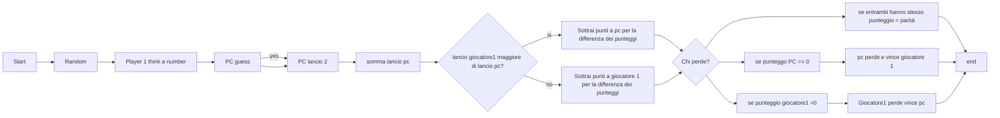

# DICE GAME

Rappresentazione del flusso di gioco e delle decisioni che vengono prese a ogni turno

- Ci sono 2 giocatori

- Ognuno lancia 2 dadi

- Entrambi i giocatori iniziano con 100 punti

- Ogni turno ciascuno lancia 2 dadi, la differenza della somme dei punteggi dei dadi viene sottratta ai punti del giocatore con il totale minore

> **Ad esempio** se il computer lancia 6 e il giocatore umano lancia 12 al computer vengono sottratti 6 punti dal punteggio di 100 aggiornato il punteggio a 94

- il primo che arriva a 0 punti o meno perde

- il gioco continua fino a quando il computer o il giocatore umano raggiungono 0 punti

> **TO DO:**  Implementare la persistenza dei dati 

# SPECTRE CONSOLE

- Sono state aggiunte le bar per rappresentare i punteggi dei 2 giocatori.

- è stato assegnato il colore blu al PC e il verde al giocatore umano invece il giallo rappresenta il punteggio

-  i punti sottratti sono stati rappresentati in rosso così come la condzione di  parità

