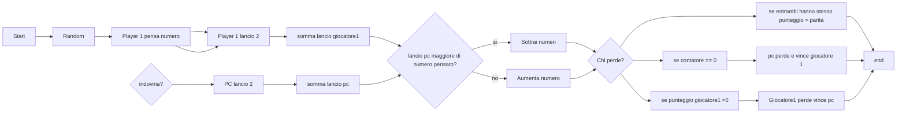

# INDOVINA NUMERO 

## Versione 2.0


Nelle versioni precedenti non abbiamo trovato un metodo che fosse sia efficiente che performante per indovinare il numero.

Quindi nella versione 2.0 vogliamo effettuare i seguenti miglioramenti:

## PREREQUISITI

    - Il programma chiede di pensare un numero all'utente senza scriverlo 
    - Il programma sceglie il primo numero in maniera casuale all'interno dell'intervallo(1-100)
    - Il programma chiede di inserire un aiuto che può essere: +, - , corretto
    - Il programma sceglie  i numeri successivi fino ad un massimo di 5 tentativi con la seguente logica:
    > Ad ogni tentativo il computer sorteggia un numero compreso tra il numero scelto in precedenza (+1 o -1) ed un numero casuale
    - Il programma stampa lo stato di gioco del computer cioè il numero di tentativi effettuati e se ha indovinato o no.


## PREREQUISITI SODDISFATTI


    - [ ] Prerequisito 1

    - [ ] Prerequisito 2

    - [ ] Prerequisito 3

    - [ ] Prerequisito 4

    - [ ] Prerequisito 5


    

<details>
    <summary>Visualizza il codice</summary>

```c#

// Guess the proper number

Random random = new Random();


int maxNumber = 100;
int minNumber = 1;
int counter = 0;
string userSuggest;


while (counter < 5)
{
    counter++;

    int guessNumber = random.Next(minNumber, maxNumber + 1);


    Console.WriteLine($"PC:I chose the number {guessNumber}.Press a button to continue...");

    Console.ReadKey();

    Console.WriteLine("PC: Please suggest me if my number is lower type + if is higher type - otherwise c");

    userSuggest = Console.ReadLine().Trim().ToLower();

    switch (userSuggest)
    {


        case "c":
            Console.WriteLine($"Congratulations you won.The game is over you guessed the number in {counter - 1} tries");
            counter = 5;
            break;

        case "+":
            minNumber = guessNumber + 1;


            break;

        case "-":

            maxNumber = guessNumber - 1;


            break;

        default:
            Console.WriteLine("Digit a correct answer between + - c");

            break;


    }

}


```

</details>


