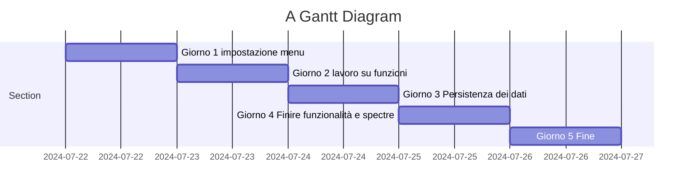
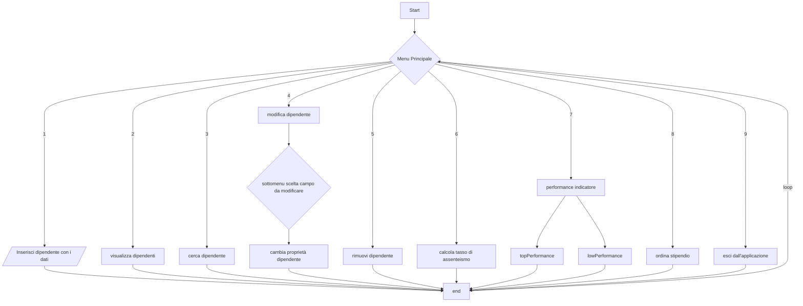

 # PROGETTAZIONE APPLICAZIONE GESTIONE  RISORSE UMANE

## GESTIONE PERSONALE   

Questa applicazione console permetterà la gestione del personale in un azienda,valutando performance,stipendi,mansioni,ore di lavoro e tasso di assenteismo.
Verranno divisi i dipendenti in 2 gruppi in base al punteggio di produttività e verranno segnalati il 15 % dei dipendenti meno performanti.
Mostra i dati relativi a stipendi e  assenze del personale calcolando in percentuale il tasso di assenteismo di ognuno.

## DEFINIZIONE DEI REQUISITI E ANALISI

L'applicazione consente ad una azienda di monitorare il personale,valutarne le performance e i costi

- [ ] L'applicazione consente di inserire il nome e cognome della persona assunta,età,mansione,score di produttività da 0 a 100,stipendio,tasso di assenteismo,mail aziendale

- [ ] Visualizzazione dei dipendenti inseriti con i relativi dati anagrafici 

- [ ] Possibilità di visionare gli stipendi annuali di ogni dipendente

- [ ] Valutazione performance e indicazione del 15% dei dipendenti meno performanti


## PIANIFICAZIONE E DESIGN DELL'ARCHITETTURA

- [ ] Impostazione del menu generale con opzioni di scelta

- [ ] Opzione di inserimento del personale con dati inseriti in modo intervallato da virgola(Split),dettagli anagrafici,stipendio,mansione,contratto,performance,assenze e salvataggio dati nel file json

- [ ] Opzione di visualizzazione di tutto il personale con i relativi dati

- [ ] Valutazione performance i dipendenti vengono divisi in 2 gruppi in base al livello della performance e viene segnalato il 15% dei dipendenti con le performance più basse il in questo sottomenu

- [ ] Calcolo assenteismo scrivendo nome e cognome  del dipendente l'utente inserisce  le ore lavorate e viene calcolato il tasso di assenteismo(assenze/ giorni da lavorare)*100

- [ ]  Opzione di ricerca del singolo dipendente inserendo nome,cognome

- [ ]  Modifica dati dipendente e implementazione di un sottomenu per scegliere il singolo campo da modificare

- [ ] rimuovi dipendente

- [ ] sorta stipendio dal più alto al più basso con mansione e dati anagrafici

## AGGIUNTA EXTRA

- [ ]  Integrazione di Spectre console per rendere il menu user friendly e per ordinare i dati in tabelle

- [ ]  Modificare alcune funzioni inserendo parametri
   
- [ ]  Integrare try and catch per gestione delle eccezioni

- [ ]  Aggiungere un campo per identificare il dipendente ovvero la mail aziendale


## DEFINIZIONE DI STRUTTURE E CONVENZIONI

Di seguito le  convenzioni di codifica e i nomi standard utilizzati.

 - [ ]  I nomi delle classi devono essere PascalCase.
 - [ ]  I nomi dei metodi devono essere PascalCase.
 - [ ]  I nomi delle variabili devono essere camelCase.
 - [ ]  I nomi delle costanti devono essere UPPERCASE.
 - [ ]  I nomi dei file devono essere lowercase.
 - [ ]  I nomi dei progetti devono essere PascalCase.
 - [ ]  I nomi dei namespace devono essere PascalCase.

 ## STRUTTURA JSON

 - Di seguito il modello di formattazione del file json di ogni dipendente inclusivo di tutti i dati

 ```json

 {
  "Nome": "fabio",
  "Cognome": "fabrizi",
  "DataDiNascita": "10/02/1976",
  "Mansione": "impiegato",
  "Stipendio": 23000.0,
  "Performance": 30,
  "Assenze": 40,
  "Mail": "fabio.fabrizi@gmail.com"
}

 ```


## SVILUPPO DEI COMPONENTI
Ora che abbiamo definito le convenzioni di codifica e i nomi standard, possiamo iniziare a scrivere il codice. In questo caso, creeremo un progetto console per l'applicazione e un progetto di test per i test unitari.

- [ ] Creare un progetto console per l'applicazione.
- [ ] Creare un progetto di test per i test unitari.

## TEST E DEBUGGING
Ora che abbiamo integrato i componenti dell'applicazione, dobbiamo testarli e risolvere eventuali bug. In questo caso, scriveremo test unitari per i componenti dell'applicazione.

 - [ ] Scrivere test unitari per i componenti dell'applicazione.
 - [ ] Eseguire il debugging per individuare e risolvere i bug


## DOCUMENTAZIONE

Ora che abbiamo testato e risolto i bug dell'applicazione, dobbiamo documentare il codice e l'architettura. In questo caso, documenteremo il codice e l'architettura dell'applicazione.

 - [ ] Documentare il codice e l'architettura dell'applicazione.

 - [ ] Documentare i test unitari.

 - [ ] Documentare la fase di Beta Testing.

 - [ ] Documentare la fase di post Beta Testing.


## SCHEDULE 



## FLOWCHART
