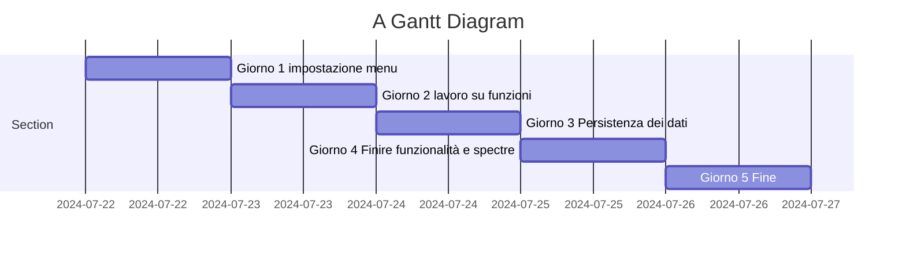
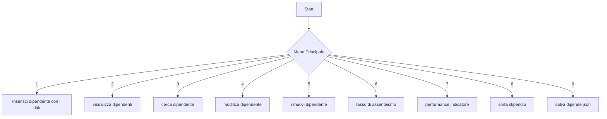

 # PROGETTAZIONE APPLICAZIONE GESTIONE  RISORSE UMANE

## GESTIONE PERSONALE   

Questa applicazione console permetterà la gestione del personale in un azienda,valutando performance,costi,assunzioni,licenziamenti,ore di lavoro e tasso di assenteismo.
Verrà segnalato il 10% dei dipendenti più performanti e il 10 % dei dipendenti meno performanti.
Simula i costi in caso di riorganizzazione del personale e mostra il tipo di mensione il contratto adottato per ogni dipendente.

## DEFINIZIONE DEI REQUISITI E ANALISI

L'applicazione consente ad una azienda di monitorare il personale,valutarne le performance e i costi

- [ ] L'applicazione consente di inserire il nome e cognome della persona assunta,età,score di produttività da 1 a 10,stipendio

- [ ] Visualizzazione dei dipendenti inseriti con i relativi dati anagrafici 

- [ ] Possibilità di visionare i costi di ogni dipendente

- [ ] Valutazione performance con sottomenu top 10 e ultimi 10  e relativi costi

## PIANIFICAZIONE E DESIGN DELL'ARCHITETTURA

- [ ] Impostazione del menu generale con opzioni di scelta

- [ ] Opzione di inserimento del personale con dati inseriti in modo intervallato da virgola(Split), anagrafici,stipendio,mansione,contratto,performance, e salvataggio dati nel file json

- [ ] Opzione di visualizzazione di tutto il personale con i relativi dati

- [ ] Valutazione performance con sottomenu divisi in 2 liste top 10 e gli ultimi 10 e relativi costi,si potrebbe richiamare il dipendente e aggiungere la valutazione in questo sottomenu

- [ ] Calcolo assenteismo scrivendo nome e cognome  del dipendente l'utente inserisce  le ore lavorate e viene calcolato il tasso di assenteismo(assenze/ giorni da lavorare)*100

- [ ]  Opzione sottomenu  cerca dipendente e inserisci valutazione da valutare questo aspetto

- [ ]  Modifica dati dipendente 

- [ ] rimuovi dipendente

- [ ] sorta stipendio dal più alto al più basso con mansione e dati anagrafici

## DEFINIZIONE DI STRUTTURE E CONVENZIONI

Ora che abbiamo deciso come organizzare il codice, dobbiamo definire le convenzioni di codifica e i nomi standard. In questo caso, useremo le convenzioni di codifica di C# e .NET e i nomi standard.

 - [ ]  I nomi delle classi devono essere PascalCase.
 - [ ]  I nomi dei metodi devono essere PascalCase.
 - [ ]  I nomi delle variabili devono essere camelCase.
 - [ ]  I nomi delle costanti devono essere UPPERCASE.
 - [ ]  I nomi dei file devono essere lowercase.
 - [ ]  I nomi dei progetti devono essere PascalCase.
 - [ ]  I nomi dei namespace devono essere PascalCase.

## SVILUPPO DEI COMPONENTI
Ora che abbiamo definito le convenzioni di codifica e i nomi standard, possiamo iniziare a scrivere il codice. In questo caso, creeremo un progetto console per l'applicazione e un progetto di test per i test unitari.

- [ ] Creare un progetto console per l'applicazione.
- [ ] Creare un progetto di test per i test unitari.

## TEST E DEBUGGING
Ora che abbiamo integrato i componenti dell'applicazione, dobbiamo testarli e risolvere eventuali bug. In questo caso, scriveremo test unitari per i componenti dell'applicazione.

 - [ ] Scrivere test unitari per i componenti dell'applicazione.
 - [ ] Eseguire il debugging per individuare e risolvere i bug

## DOCUMENTAZIONE

Ora che abbiamo testato e risolto i bug dell'applicazione, dobbiamo documentare il codice e l'architettura. In questo caso, documenteremo il codice e l'architettura dell'applicazione.

 - [ ] Documentare il codice e l'architettura dell'applicazione.

 - [ ] Documentare i test unitari.

 - [ ] Documentare la fase di Beta Testing.

 - [ ] Documentare la fase di post Beta Testing.

## SCHEDULE 

## FLOWCHART
