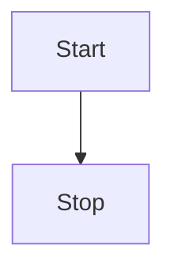
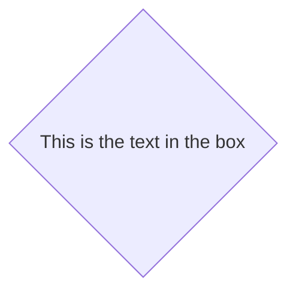
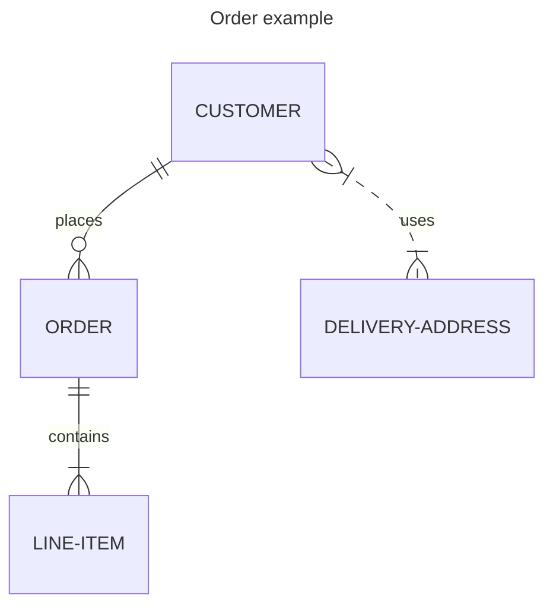
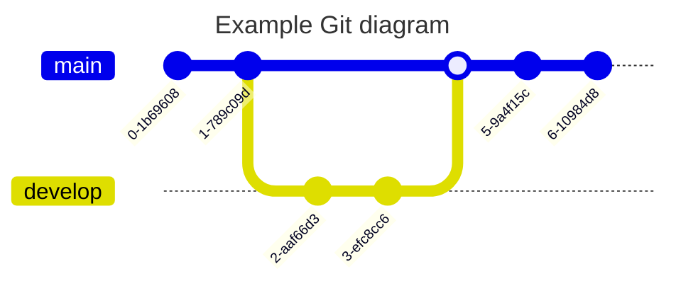

# Titolo principale
## Sottotitolo
### Titolo paragrafo

> esempio di quote (citazione)

esempio di  __grassetto__ oppure **bold**

esempio di _italic_

- primo
    - sottoelenco

- secondo
    - sottoelenco

- terzo

## esempio di checkbox

- [x] abab

- [ ] primo


## backtick (alt + 96)  diventa codice

```
git status
git add
git commit

```
```c#
class program
{
    static void Main(string[]args)
    {
        Console.WriteLine("Hello World!");
    }

}

```

```html
<div>
    <p>testo</p>
</div>

```
```css
div.split
{height:1.2em;background-color: #CCC}

```

[link a pagina 2](02_link.md)

[link a pagina 3](mettifilequi)

<!--  Commento che non compare nel render markdown -->

| Syntax | Description |
|--------| --------------|
| Header | Title|
|Paragraph | ![esempio di SVG di svg repo]|

<details>

<summary>Tips for collapsed sections </summary>

# you can add a header

You can add text within collapsed section.

You can add an image or code block too.

```ruby
    puts "Hello World"
```

</details>







